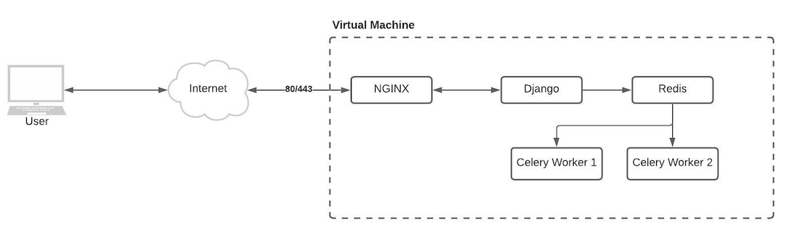
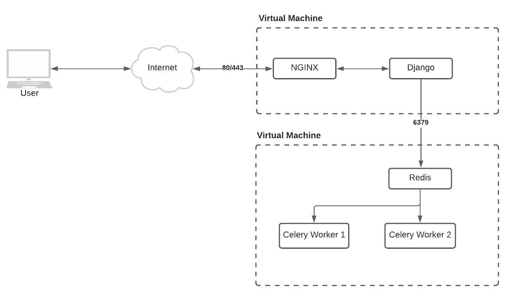

# Recommended Library

These are the libraries that is recommended to use when working with Excel.

- [OpenPyXL](https://openpyxl.readthedocs.io/en/stable/) this library allow us to
easily handling excel.
- [PyExcelerate](https://github.com/kz26/PyExcelerate) this library is used when
you need only speed meaning there is only data in the excel file, but if you need
personalization like color space it's not recommended.
- [Django Excel Tools](https://github.com/NorakGithub/django-excel-tools) this library
is used to validate data from excel.

# Import Data From Excel

Here are some best practices when working with importing data from excel.

## Data Validation

It is important to import correct data to our system, and we're not able to
trust if user only fill the correct data. So before importing data to the system,
each row and column must be validated. Doing this manually would take
too much time, so I would recommend using [Django Excel Tools](https://github.com/NorakGithub/django-excel-tools) for data validation.

## Simple Technique

### When to use this technique?

The data importing will never be more than 2000 rows. (Tip validation and raise
400 when data is more than 2000 rows)

### How?

This would required a minimal setup, here the guides:

- User upload the excel.
- API received excel, and validate data inside excel.
- Import data to the system.
- When import data to the database try to import in chunks, says you have 2000
rows of data you split it into 500 rows each to import to the database.
- Return import status back to user.

Overall process should not take any longer than 30 seconds.

### Architecture


## Advance Technique

### When to use this technique?

You don't know how many rows will be imported to the system at a time.

### How?

This would required more setup because we will need background workers (Celery),
here are some guides:

- User upload the excel.
- API received excel, and validate data inside excel.
- After data validated, send file to background worker, then return status 203 as
the task has been accepted.
- When importing to database try to split into chunks, says you have 100,000 of
rows, you should split into 5,000 each time importing to the database.
- (Optional) Use more than one worker, so that you can import data in parallels.
- Use COPY instead of INSERT. There are limitation when using COPY, but COPY is
way more faster than INSERT. Read more about COPY [here](https://www.postgresql.org/docs/9.2/sql-copy.html).

### Architecture

#### Minimum



#### Recommended

It's recommended to separate between worker and API server because usually workers
will use a lot of resources, so if workers down it wouldn't affect API Server.



# Export Data to Excel

Here are some best practices when working with exporting data from database to
excel.

## Simple

### When to use this technique?

If the data to export is no more than 2000 rows.

### How?

This would required a minimal setup, here the guides:

- User request excel report via API.
- API Server received request then query the database.
- Return excel report via api.

### Architecture


## Advance

### When to use this technique?

If you have no idea how many rows it's gonna be or it will be more than 2000 rows.

### How?

This would required more setup because we will need background workers (Celery),
here are some guides:

- User request excel file via API.
- API server received the request, then send this job to background worker,
finally response 203 status code meaning the job is successfully accepted.
- In worker, when query data from database it's recommend to split it chunks.
Says 2000 rows per query, you can use SQL `LIMIT` and `OFFSET` to achieve this.
This prevent database from crashing when requesting too much data at once.
- (Optional) Use more than one worker, so we can export data in parallels.

*Note: Using `OFFSET` might cause performance problem later on, but this method
providing easier to implement. If that the case, you can sort the data and use
`WHERE` instead.*

Example:

```sql
select *
from tbl_name
order by id
where id < 2000
limit 2000
```

### Architecture

#### Minimum


#### Recommended

It's recommended to separate between worker and API server because usually workers
will use a lot of resources, so if workers down it wouldn't affect API Server.


# Progress

For a better UX, we should displaying the progress of import/export data to user.
There are multiple ways of doing this:

- Provide an API Endpoint for frontend to call every, says 5 seconds, and frontend display progress to user.
API response payload should contain progress value. This is easy to implement, but kinda
bad for the performance and resource usage.
- Using Web Socket that wait for push event from backend. This is not easy to implement, but better in term
of performance and resource usage.
